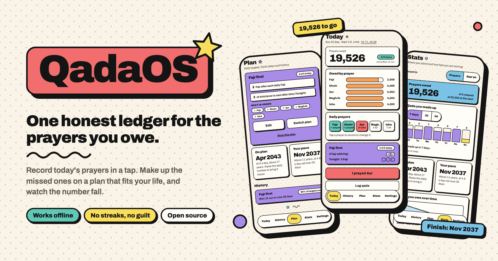
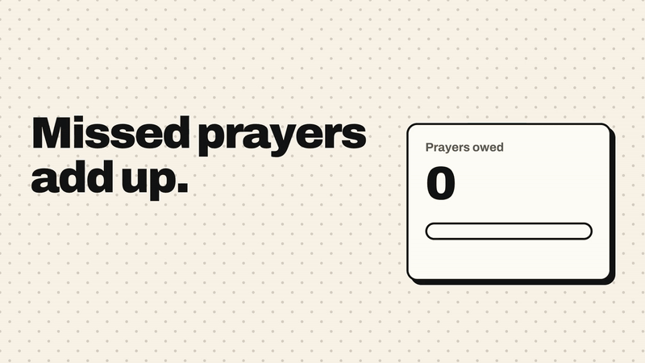
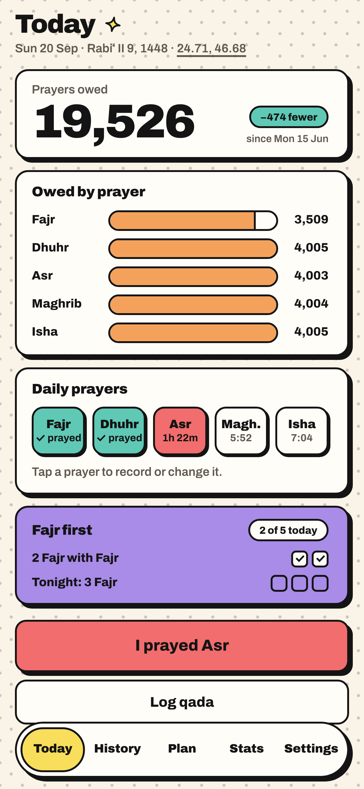
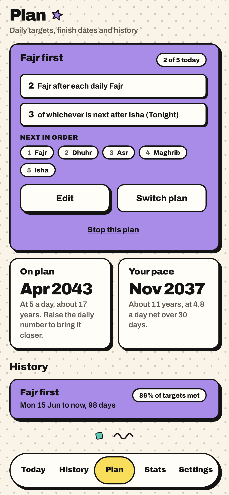
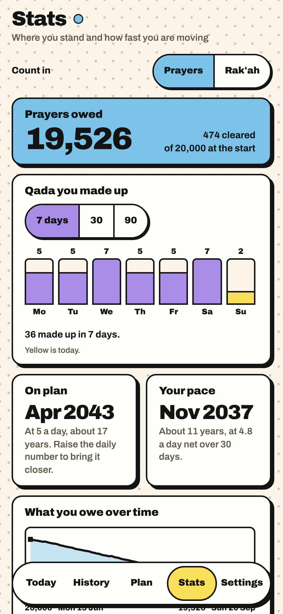
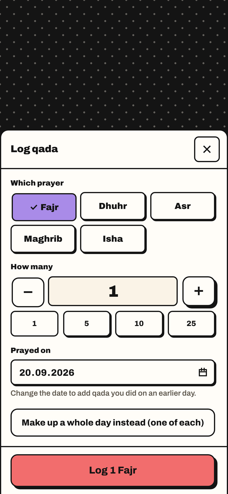
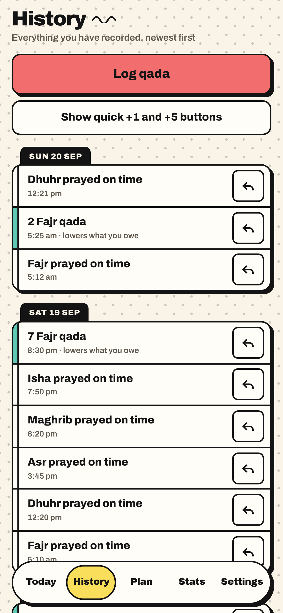
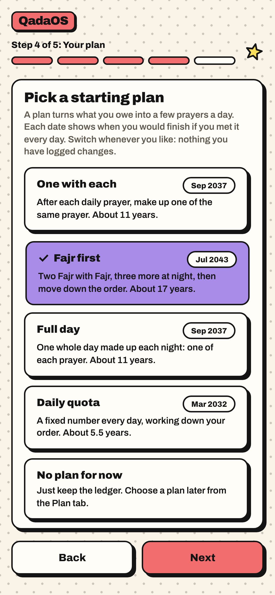
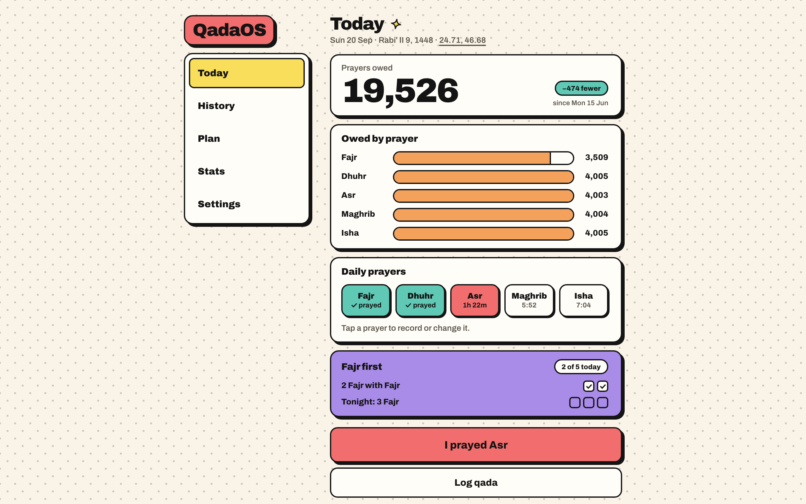

<p align="center">
  <a href="https://qadaos.vercel.app">
    
  </a>
</p>

<p align="center">
  <a href="https://qadaos.vercel.app"><b>Open the app</b></a>
  &nbsp;·&nbsp;
  <a href="#watch-it">Watch it</a>
  &nbsp;·&nbsp;
  <a href="#take-the-tour">Take the tour</a>
  &nbsp;·&nbsp;
  <a href="#run-your-own">Run your own</a>
</p>

# QadaOS

Years of missed prayers turn into one number you would rather not look at. QadaOS keeps that number honest and makes it fall.

You record today's prayers in a tap. You make up missed ones (qada) on a plan that fits your life. You can switch plans whenever you like, and nothing you have already logged ever changes.

It is a web app you install from the browser. It is free, open source, and it works offline.

## Watch it

<p align="center">
  <a href="docs/media/qadaos.mp4">
    
  </a>
</p>

<p align="center"><sub>Twenty seconds. Click it for the full quality video. There is no music, on purpose.</sub></p>

## Take the tour

<table>
  <tr>
    <td width="33%"></td>
    <td width="33%"></td>
    <td width="33%"></td>
  </tr>
  <tr>
    <td valign="top"><b>Today.</b> What you owe, today's five prayers, and today's targets. The coral button is always the next thing to do.</td>
    <td valign="top"><b>Plan.</b> Rules like "two Fajr with Fajr, three more at night". You see when you would finish on the plan, and at your real pace.</td>
    <td valign="top"><b>Stats.</b> What you made up this week, this month, this quarter, and the whole debt over time.</td>
  </tr>
  <tr>
    <td></td>
    <td></td>
    <td></td>
  </tr>
  <tr>
    <td valign="top"><b>Log qada.</b> Pick a prayer, pick a count, done. You can backdate it, or make up a whole day at once.</td>
    <td valign="top"><b>History.</b> Everything you recorded, newest first. Every line has an undo, and every undo can be restored.</td>
    <td valign="top"><b>Starting out.</b> Not sure how many you owe? Estimate from two dates. Every plan shows its finish date before you choose.</td>
  </tr>
</table>

It also stretches out on a big screen.

<p align="center"></p>

## Questions people ask

<details>
<summary><b>What happens if I miss a prayer today?</b></summary>
<br />
Nothing happens by itself. When a prayer's time passes without an answer it becomes <i>pending</i>, and the app asks you later. You say on time, late, missed or exempt. Only a miss you confirm is added to what you owe.
</details>

<details>
<summary><b>Can I change my plan halfway through?</b></summary>
<br />
Yes, as often as you like. A plan only decides today's targets and the projected finish date. Your logged prayers are separate facts, so switching never loses or rewrites them. Each plan you used keeps its own report of how closely you followed it.
</details>

<details>
<summary><b>I logged something by mistake. Now what?</b></summary>
<br />
Undo it from the toast or from History. The undo is recorded too, so you can restore it, and two devices never disagree about what happened.
</details>

<details>
<summary><b>Does it follow a particular school?</b></summary>
<br />
No. The prayer time method, the Asr rule, whether you track Witr, and when Isha ends are all settings with neutral defaults. QadaOS keeps the count. Questions of fiqh belong with someone qualified to answer them.
</details>

<details>
<summary><b>Where are the streaks and badges?</b></summary>
<br />
There are none, and there never will be. You get progress and pace. A missed day is a fact in the ledger, not a broken chain.
</details>

<details>
<summary><b>Does it work without a connection? Who can see my data?</b></summary>
<br />
Everything works offline and syncs when you are back online. Sign in with Google or a passkey and your phone and laptop stay in step. The hosted app has no analytics, shares nothing, lets you export everything, and deletes everything when you ask.
</details>

## Try it in a minute

1. Open **[qadaos.vercel.app](https://qadaos.vercel.app)** on your phone and sign in.
2. Set your location, so prayer times are right.
3. Enter what you owe, or estimate it from two dates.
4. Pick a starting plan. You can change it later.
5. Add it to your Home Screen. On iPhone, reminders only work once it is installed.

## Under the hood

QadaOS is built with Next.js, React, TypeScript and Tailwind. Postgres holds the synced copy, IndexedDB holds the copy on your device, and a service worker makes it installable and offline.

The interesting part is small. Every action is an immutable event with an id made on your device. What you owe, today's targets and the finish dates are all calculated from those events and never stored. Sync is a plain set union, so two devices always arrive at the same ledger.

<details>
<summary><b>The seven events</b></summary>
<br />

`debt.set_initial`, `debt.adjust`, `qada.logged`, `daily.resolved`, `strategy.started`, `strategy.stopped` and `event.revoked`.

The device pushes its outbox. The server inserts with `ON CONFLICT DO NOTHING` and hands out an increasing sequence number. The device pulls everything after its cursor. The reducer sorts by time and id, so the result is the same everywhere.

All of this lives in `src/domain`, which is plain TypeScript with no React and no database. The screens never do the math themselves.

</details>

<details>
<summary><b>Run it locally</b></summary>
<br />

You need Node 24.

```bash
npm install --legacy-peer-deps
NEXT_PUBLIC_AUTH_OPTIONAL=true npm run dev
```

That runs the whole app with no database and no Google credentials. Sync fails quietly and everything keeps working on your device. Never set that variable in production.

```bash
npm test          # unit tests for the domain and the store
npm run test:e2e  # Playwright, starts its own dev server
npm run typecheck && npm run lint
npm run build
```

To regenerate the screenshots and the banner on this page:

```bash
README_SHOTS=1 npx playwright test e2e/readme-shots.spec.ts
```

</details>

## Run your own

<details>
<summary><b>Self-host on Vercel in seven steps</b></summary>
<br />

1. Fork this repo and import it into Vercel.
2. **Database.** Add Neon from the Vercel Marketplace, or point `DATABASE_URL` at any Postgres. Run `npm run db:migrate` once.
3. **Google sign-in.** Create a Web OAuth client in Google Cloud Console. Add `https://<your-domain>/api/auth/callback/google` as a redirect URI. Set `GOOGLE_CLIENT_ID` and `GOOGLE_CLIENT_SECRET`.
4. **Auth secret.** Set `BETTER_AUTH_SECRET` from `openssl rand -base64 32`. Set `BETTER_AUTH_URL` to your public origin with no trailing slash.
5. **Push.** Run `npx web-push generate-vapid-keys`. Set `VAPID_PUBLIC_KEY`, `VAPID_PRIVATE_KEY`, `VAPID_SUBJECT`, and `NEXT_PUBLIC_VAPID_PUBLIC_KEY` with the same value as the public key.
6. **Reminders.** Set `REMINDER_DISPATCH_SECRET`. Schedule a POST to `https://<your-domain>/api/reminders/dispatch` every 5 minutes with the header `Authorization: Bearer <secret>`. Upstash QStash from the Marketplace does this on the free plan.
7. Deploy, open it on your phone, and add it to your Home Screen.

Every variable is listed in `.env.example`.

</details>

The full specification, with every decision and every deviation, is in [`docs/specs/2026-09-19-qadaos-v1.md`](docs/specs/2026-09-19-qadaos-v1.md).

## Contributing

Issues and pull requests are welcome. Read [`CLAUDE.md`](CLAUDE.md) first. It holds the rules the codebase keeps: events are never edited, the screens never compute, and there are no streaks.

## License

[MIT](LICENSE). Use it, fork it, host it for your community.
